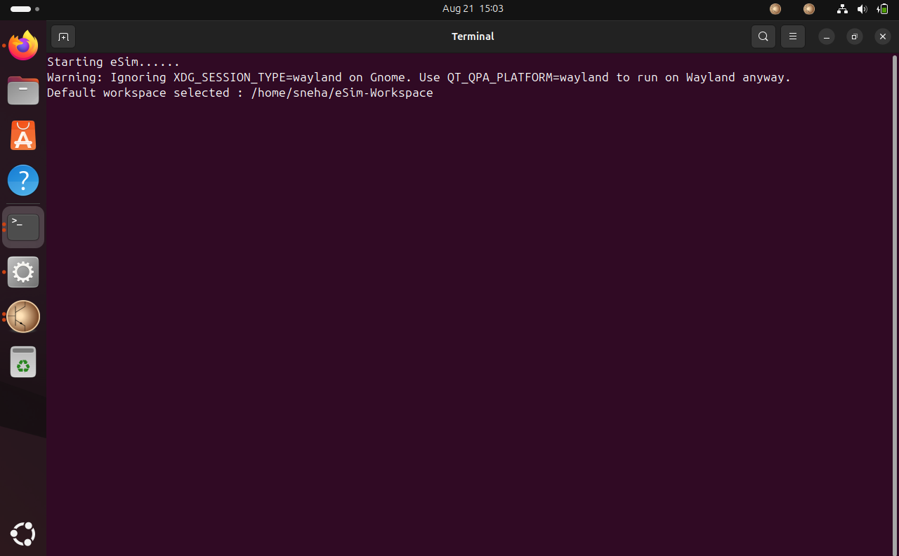
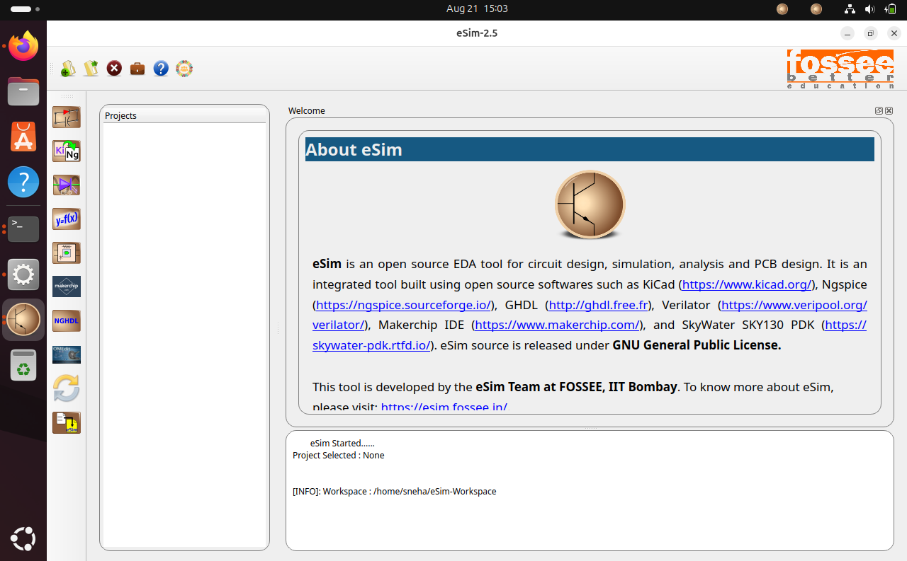

# eSim 2.5 Installation Report — Ubuntu 25.04

**Author:** Sneha Sharma
**Task:** eSim Semester Long Internship – Autumn 2026, Task 4 (eSim Upgradation)
**Date:** August 2026

---

## TL;DR

- Attempted a clean install of eSim-2.5 on a fresh Ubuntu 25.04 VM using `Ubuntu/install-eSim.sh` from the `installers` branch.
- **10 distinct issues** were found across ~12 install attempts; **8 were fixed** at the code level, **2 documented** (one environmental, one a process pitfall).
- **Before:** the installer failed at a bash syntax error before a single package was installed (0% complete).
- **After:** `install-eSim.sh --install` completes with `eSim Installed Successfully`, the `esim` command launches, and the full eSim-2.5 GUI opens and runs correctly.
- **Key systemic finding:** the `Ubuntu/` installer directory on the `installers` branch is missing several assets (`library/`, `nghdl.zip`, `src/`, `images/`) that exist only under `MacOS/`. This is not one bug but one root cause behind four separate failures (Issues 3, 5, 10) — see Section 4.

## Quick Reproduce

```bash
# On a fresh Ubuntu 25.04 VM:
git clone https://github.com/FOSSEE/eSim.git
cd eSim && git checkout installers
cd Ubuntu
chmod +x install-eSim.sh
./install-eSim.sh --install
# → fails immediately: "syntax error near unexpected token `}'" at line 70
```
This single command is enough to reproduce Issue 1 on an unmodified `installers` branch checkout. Later issues surface progressively once earlier ones are fixed (see Section 3).

---

## 1. Environment

| Item | Detail |
|---|---|
| Host OS | Windows |
| Virtualization | Oracle VirtualBox |
| Guest OS | Ubuntu 25.04 (codename `plucky`) — fresh install |
| Guest RAM allocated | 3072 MB |
| eSim version | 2.5 (from `installers` branch, FOSSEE/eSim) |
| Installer script | `Ubuntu/install-eSim.sh` → dispatches to `Ubuntu/install-eSim-scripts/install-eSim-25.04.sh` |
| Verified via | `cat /etc/os-release` → `VERSION_ID="25.04"`; `lsb_release -d` → `Ubuntu 25.04` |
| Debugging effort | ~12 full install attempts, iterative fix-and-retry across roughly a day |

## 2. Method

1. Forked `FOSSEE/eSim` on GitHub to `Sneha-ops3124/eSim`.
2. Cloned the fork inside the Ubuntu 25.04 VM, fetched and checked out the `installers` branch from upstream (it was not present on the fork by default and had to be fetched explicitly from `FOSSEE/eSim`).
3. Created a working branch `esim-2.5-ubuntu25.04-fixes` off `installers`.
4. Ran `./install-eSim.sh --install` repeatedly, logging full output via `script -c "./install-eSim.sh --install" ~/esim_install_runN.log` for each attempt.
5. For each failure: located the exact line in the relevant script using `grep`/`sed`, diagnosed the root cause, applied a fix (or a documented workaround), verified with `bash -n`, and re-ran the installer.
6. Repeated until `esim` launched successfully with a working GUI.

## 3. Issues Found and Fixes

### Issue 1 — Syntax error in `install-eSim.sh` (blocks the entire install)
**Severity:** Critical — script cannot run at all.
**Location:** `Ubuntu/install-eSim.sh`, around line 53–70, inside `run_version_script()`.
**Symptom:**
./install-eSim.sh: line 70: syntax error near unexpected token }' ./install-eSim.sh: line 70: }'
**Root cause:** An `if [[ -f "$SCRIPT" ]]; then ... bash "$SCRIPT" "$ARGUMENT"` block was never closed with `fi`. Immediately after it, several `echo ... >> $config_dir/$config_file` lines (writing the eSim config file) appear with no enclosing `function` header — these lines reference `config_dir`/`config_file`, variables used nowhere else in the file, strongly suggesting the original function definition (e.g. a `writeEsimConfig` function) lost its header and closing brace at some point.
**Fix:** Added the missing `fi` to close the `if` block, and wrapped the orphaned config-writing lines in a new properly-declared function `writeEsimConfig`.
**Status:** Fixed and verified with `bash -n install-eSim.sh` (clean, no output).

```bash
# Before
    if [[ -f "$SCRIPT" ]]; then
        echo "Running script: $SCRIPT $ARGUMENT"
        bash "$SCRIPT" "$ARGUMENT"
    echo "[eSim]" >> $config_dir/$config_file
    ...
}

# After
    if [[ -f "$SCRIPT" ]]; then
        echo "Running script: $SCRIPT $ARGUMENT"
        bash "$SCRIPT" "$ARGUMENT"
    fi
}

function writeEsimConfig
{
    echo "[eSim]" >> $config_dir/$config_file
    ...
}
```

---

### Issue 2 — Misleading "ProxyError" from pip during `pip install watchdog`
**Severity:** Low (environmental, not a script bug) — but confusing enough to derail debugging.
**Symptom:**
WARNING: Retrying ... after connection broken by 'ProxyError('Cannot connect to proxy.', ...
Temporary failure in name resolution
ERROR: No matching distribution found for watchdog
**Investigation:** Checked `env | grep -i proxy` (empty), GNOME's `gsettings get org.gnome.system.proxy mode` (`'none'`), `/etc/pip.conf`, `/etc/apt/apt.conf.d/*proxy*` — no proxy configuration existed anywhere on the system. `ping -c 4 8.8.8.8` and `ping -c 4 pypi.org` both showed partial packet loss (25–50%), and DNS resolution itself worked fine.
**Root cause:** Not an actual proxy issue. VirtualBox's NAT networking caused intermittent packet loss; `pip`/`urllib3`'s error handling mislabels certain connection failures as `ProxyError` even when no proxy is configured, which is a known point of confusion in recent `pip` versions.
**Status:** Documented; resolved itself on retry once network conditions improved. No script change needed, but worth flagging since the misleading error text can send developers down the wrong debugging path.

---

### Issue 3 — `Ubuntu/library/` directory entirely missing from the `installers` branch
**Severity:** High — blocks KiCad library setup, a core step of installation.
**Symptom:**
tar (child): library/kicadLibrary.tar.xz: Cannot open: No such file or directory
**Investigation:** `find ~/eSim -iname "kicadLibrary.tar.xz"` located the file only under `MacOS/library/kicadLibrary.tar.xz`. `ls ~/eSim/Ubuntu/library/` confirmed the directory does not exist at all under `Ubuntu/`, even though `install-eSim-scripts/install-eSim-25.04.sh` (line 232) references it via a relative path (`tar -xJf library/kicadLibrary.tar.xz`).
**Root cause:** The `Ubuntu/` installer directory on the `installers` branch is not self-contained — it is missing assets that exist under `MacOS/` (and are presumably bundled together only in the official downloadable release zip from esim.fossee.in/downloads, not in a raw git checkout of this branch).
**Fix (workaround):**
```bash
cp -r ~/eSim/MacOS/library ~/eSim/Ubuntu/library
```
**Status:** Worked around by copying the equivalent library assets from `MacOS/`, which are identical/shared content across platforms. A proper long-term fix would be for FOSSEE to include a `library/` folder directly under `Ubuntu/` in the `installers` branch, or adjust the script's path resolution to point at a shared top-level `library/` directory.

---

### Issue 4 — `installKicad()` uses `exit 0` instead of `return 0`, silently truncating the entire install
**Severity:** High — reports success (exit code 0) while leaving the install incomplete; especially damaging because it triggers on every *retry* after the first successful KiCad install.
**Location:** `Ubuntu/install-eSim-scripts/install-eSim-25.04.sh`, `installKicad()` function, ~line 136.
**Symptom:** Script printed "KiCad 8.0 is already installed." then immediately printed "Script done." with exit code 0 — but no library copy, NGHDL, SKY130 PDK, or desktop-icon steps ran, and no `esim` command was created.
**Root cause:**
```bash
else
    echo "KiCad 8.0 is already installed."
    exit 0
fi
```
`exit 0` terminates the *entire script process*, not just the `installKicad` function. Since the caller (`run_version_script`) expected `installKicad` to return control so it could proceed to call `copyKicadLibrary`, `installNghdl`, `installSky130Pdk`, and `createDesktopStartScript`, all of those steps were silently skipped — yet the script exits with code 0, making it look like a clean success.
**Fix:**
```bash
else
    echo "KiCad 8.0 is already installed."
    return 0
fi
```
**Status:** Fixed and verified — after this change, the installer correctly proceeded to the library copy and subsequent steps on the very next run.

---

### Issue 5 — `nghdl.zip` missing from `Ubuntu/` (same pattern as Issue 3)
**Severity:** High — blocks the entire NGHDL (mixed-signal simulation) subsystem.
**Symptom:**
unzip: cannot find or open nghdl.zip, nghdl.zip.zip or nghdl.zip.ZIP.
**Investigation:** `find ~/eSim -iname "nghdl.zip"` located it only under `MacOS/nghdl.zip`; nothing existed under `Ubuntu/` or the repo root.
**Fix (workaround):**
```bash
cp ~/eSim/MacOS/nghdl.zip ~/eSim/Ubuntu/
```
**Status:** Worked around. Same systemic root cause as Issue 3 — see Section 4.

---

### Issue 6 — NGHDL's own installer has no Ubuntu 25.04 support (`nghdl/install-nghdl.sh`)
**Severity:** High — blocks NGHDL specifically even once the zip is present.
**Symptom (part A — version detection returns empty):**
Detected Ubuntu Version:
Unsupported Ubuntu version: 25.04 ()
**Root cause A:** The version-capture regex only matches three-part version strings:
```bash
FULL_VERSION=$(lsb_release -d | grep -oP '\d+\.\d+\.\d+')
```
Ubuntu 25.04's `lsb_release -d` output is `Ubuntu 25.04` — only two number groups — so the regex matches nothing and `FULL_VERSION` is empty.

**Root cause B:** Even independent of the regex bug, the `case $VERSION_ID in ... esac` dispatch block inside `nghdl/install-nghdl.sh` has cases for `"22.04"`, `"23.04"`, `"24.04"`, but **no `"25.04"` case at all** — it falls through to the `*)` catch-all ("Unsupported Ubuntu version") regardless. There is also no `install-nghdl-25.04.sh` script present under `nghdl/install-nghdl-scripts/` (only 22.04/23.04/24.04 versions exist).

**Fix:**
1. Relaxed the regex to make the third version segment optional:
```bash
   FULL_VERSION=$(lsb_release -d | grep -oP '\d+\.\d+(\.\d+)?')
```
2. Added a new case:
```bash
   "25.04")
       SCRIPT="$SCRIPT_DIR/install-nghdl-25.04.sh"
       ;;
```
3. Created `install-nghdl-25.04.sh` by copying `install-nghdl-24.04.sh` as a starting point (Ubuntu 25.04 is close enough to 24.04 in package availability to serve as a reasonable base — see Issues 8 and 9 for the two package-level fixes this still required).

**Status:** Fixed at the source level (see Issue 7 for a critical caveat on *where* this fix must be applied).

---

### Issue 7 — Fixes inside `nghdl.zip` do not persist unless the zip itself is repacked (systemic / process pitfall)
**Severity:** High (subtle) — not a bug in eSim's install logic per se, but a real trap that cost significant debugging time and would affect any contributor attempting the same fix.
**Symptom:** After editing the already-extracted `nghdl/install-nghdl.sh` and `nghdl/install-nghdl-scripts/install-nghdl-25.04.sh` directly and re-running the installer, the *exact same* "Unsupported Ubuntu version" and "package not found" errors reappeared as if no fix had been applied.
**Root cause:** `install-eSim-25.04.sh` runs `unzip -o nghdl.zip` on every install attempt, which **overwrites the already-extracted `nghdl/` folder** with the original, unmodified contents bundled inside `nghdl.zip`. Any manual edit made to the extracted copy is silently discarded the moment the installer is re-run — the fix appears to "not work" when in fact it was simply erased before use.
**Fix / correct workflow:**
```bash
mkdir -p /tmp/nghdl_fix && cd /tmp/nghdl_fix
unzip -o ~/eSim/Ubuntu/nghdl.zip
# ... edit files inside this extracted copy ...
rm ~/eSim/Ubuntu/nghdl.zip
zip -r ~/eSim/Ubuntu/nghdl.zip nghdl/
```
Fixes must be applied to a copy extracted independently, then the entire `nghdl.zip` archive must be rebuilt from the corrected folder and placed back at `Ubuntu/nghdl.zip`.
**Suggested upstream fix:** the installer could check whether `nghdl/` already exists and skip re-extraction (or warn explicitly that `nghdl.zip` is the single source of truth and any local edits to the extracted folder will be discarded), rather than unconditionally running `unzip -o` on every invocation.
**Status:** Documented and worked around for the remainder of this task.

---

### Issue 8 — Obsolete package `libcanberra-gtk-module` removed from Ubuntu 25.04 repositories
**Severity:** Medium — blocks NGHDL/GHDL dependency installation.
**Location:** `nghdl/install-nghdl-scripts/install-nghdl-25.04.sh` (copied from the 24.04 script per Issue 6).
**Symptom:**
Package libcanberra-gtk-module is not available, but is referred to by another package.
Error: Package 'libcanberra-gtk-module' has no installation candidate
**Investigation:** `apt-cache search libcanberra` confirmed only the GTK3 successor, `libcanberra-gtk3-module`, remains available in Ubuntu 25.04's repositories; the older GTK2-era `libcanberra-gtk-module` has been dropped entirely. The script's original line installed both packages in a single `apt install` command, causing the whole command to fail due to the one missing package.
**Fix:**
```bash
# Before
sudo apt install -y libcanberra-gtk-module libcanberra-gtk3-module
# After
sudo apt install -y libcanberra-gtk3-module
```
**Status:** Fixed (applied inside the extracted copy and repacked into `nghdl.zip` per Issue 7's workflow).

---

### Issue 9 — GHDL's LLVM version check rejects LLVM 20 (Ubuntu 25.04's default)
**Severity:** Medium-High — blocks the GHDL build step of NGHDL.
**Symptom:**
Unhandled version llvm 20.1.2
**Investigation:** `llvm-config --version` reported `20.1.2` — Ubuntu 25.04's default `llvm`/`llvm-dev` meta-packages now resolve to LLVM 20. GHDL 4.1.0 (bundled inside `nghdl.zip`) has a hardcoded list of LLVM versions it recognizes as supported, and 20.x is not among them, so its `configure` step aborts even though an older, GHDL-compatible LLVM (`libllvm18`) was already present on the system as a transitive dependency.
**Fix:** Installed and pinned to `llvm-18` specifically instead of the generic `llvm` package, and pointed GHDL's build configuration at the versioned binary:
```bash
sudo apt install -y llvm-18 llvm-18-dev
...
./configure --with-llvm-config=/usr/bin/llvm-config-18
```
**Status:** Fixed. GHDL subsequently built and NGHDL reported "NGHDL installed successfully."

---

### Issue 10 — `src/` and `images/` directories also missing from `Ubuntu/` (same systemic pattern)
**Severity:** High — without `src/`, the `esim` launcher command has no application code to run at all.
**Symptom (image copy step):**
/usr/bin/esim: line 2: cd: /home/sneha/eSim/Ubuntu/src/frontEnd: No such file or directory
python3: can't open file '/home/sneha/eSim/Ubuntu/Application.py': [Errno 2] No such file or directory
**Investigation:** `find ~/eSim -iname "Application.py"` and `find ~/eSim -iname "logo.png"` both resolved only to paths under `MacOS/` (`MacOS/src/frontEnd/Application.py`, `MacOS/images/logo.png`) — confirming neither `src/` nor `images/` exist under `Ubuntu/` in this branch checkout.
**Fix (workaround):**
```bash
cp -r ~/eSim/MacOS/src ~/eSim/Ubuntu/src
cp -r ~/eSim/MacOS/images ~/eSim/Ubuntu/images
```
**Status:** Fixed. This is the fourth occurrence of the same systemic gap (alongside Issues 3 and 5) — see Section 4.

---

## 4. Systemic Root-Cause Note (Issues 3, 5, 10)

Four separate missing-file errors (`library/`, `nghdl.zip`, `src/`, `images/`) all shared one underlying cause: **the `Ubuntu/` subdirectory of the `installers` branch, as checked out via `git clone`, is not a self-contained installer folder.** All of the missing assets exist under `MacOS/` and are presumably bundled into `Ubuntu/` only inside the official pre-packaged release zip distributed at esim.fossee.in/downloads, which this task's raw git-based workflow does not have access to. Anyone attempting to build/test the Ubuntu installer directly from a git checkout of the `installers` branch (rather than the release zip) will hit this same wall repeatedly.

**Suggested fix for FOSSEE:** either (a) populate `Ubuntu/` with its own copies of these assets in the `installers` branch, or (b) refactor the install scripts to reference a single shared top-level `library/`, `src/`, and `images/` directory rather than platform-specific duplicates, or (c) explicitly document in `CONTRIBUTING.md`/`INSTALL` that the Ubuntu installer must be run from the official release zip, not a bare git checkout of `installers`.

## 5. Final Install Status

- [x] `install-eSim.sh --install` completes with **"eSim Installed Successfully"**
- [x] `esim` command launches from terminal
- [x] eSim-2.5 main GUI window opens (Projects panel, KiCad/NGHDL/Makerchip/Verilator toolbar icons, welcome screen all render correctly)
- [x] Default workspace created at `/home/sneha/eSim-Workspace`

**Terminal launch output:**



**eSim-2.5 GUI running successfully on Ubuntu 25.04:**



## 6. Summary Table

| # | Issue | Severity | Status |
|---|---|---|---|
| 1 | Syntax error (`fi`/orphaned function) in `install-eSim.sh` | Critical | Fixed |
| 2 | Misleading pip "ProxyError" (actually VM network packet loss) | Low | Documented |
| 3 | `Ubuntu/library/` missing | High | Fixed (workaround) |
| 4 | `installKicad` uses `exit 0` instead of `return 0` | High | Fixed |
| 5 | `Ubuntu/nghdl.zip` missing | High | Fixed (workaround) |
| 6 | NGHDL installer: no 25.04 regex/case support | High | Fixed |
| 7 | Edits inside `nghdl.zip` don't persist without repacking | High (subtle) | Documented + worked around |
| 8 | Obsolete `libcanberra-gtk-module` package | Medium | Fixed |
| 9 | GHDL rejects LLVM 20 | Medium-High | Fixed |
| 10 | `Ubuntu/src/`, `Ubuntu/images/` missing | High | Fixed (workaround) |

**Total issues reported:** 10
**Total issues fixed (code or working fix applied):** 8
**Documented but not code-fixed:** 2 (Issue 2 environmental; Issue 7 process note, though its downstream effects were worked around)
**End result:** eSim-2.5 GUI fully functional on Ubuntu 25.04.

